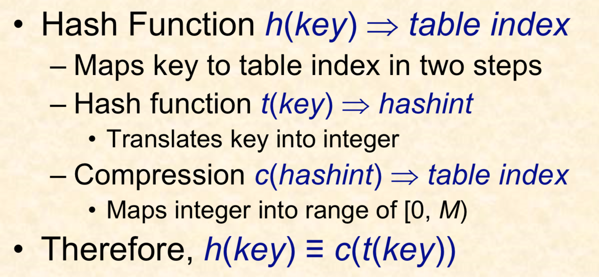

## DFS


## BFS

Using Stack

```c++


```


## Uniont Find


## Hash Map 实现
hash function 映射Key到address


- Integer
```c++

```


```c++
class MyHashMap {
public:
    
    vector<list<pair<int,int>>> my_map;
    int max_size = 10000;
    
    /** Initialize your data structure here. */
    MyHashMap() {
        my_map.resize(max_size);
    }
    // hash function 在这里有很多种
    // for integer, we just mod it with the bucket size 
    int hash_func(int key){
        return key % max_size;
    }
    
    /** value will always be non-negative. */
    void put(int key, int value) {
        int hash_index = hash_func(key);
        list<pair<int,int>>::iterator iter;
        list<pair<int,int>> & link_list=my_map[hash_index];
        for(iter = link_list.begin();iter!=link_list.end();iter++){
            if((*iter).first==key){
                (*iter).second = value;
                return;
            }
        }
        link_list.emplace_back(key, value);
    }
    
    /** Returns the value to which the specified key is mapped, or -1 if this map contains no mapping for the key */
    int get(int key) {
        int hash_index = hash_func(key);
        list<pair<int,int>>::iterator iter;
        list<pair<int,int>> & link_list = my_map[hash_index];
        for(iter = link_list.begin();iter!=link_list.end();iter++){
            if((*iter).first==key){
                return (*iter).second;
            }
        }
        return -1;
    }
    
    /** Removes the mapping of the specified value key if this map contains a mapping for the key */
    void remove(int key) {
        int hash_index = hash_func(key);
        list<pair<int,int>>::iterator iter;
        list<pair<int,int>> & link_list = my_map[hash_index];
        for(iter = link_list.begin();iter!=link_list.end();iter++){
            if((*iter).first==key){
                link_list.erase(iter);
                return;
            }
        }
    }
};
```


## Quick sort


## Merge sort

## Insert sort


## Bubble sort


## Selectiong sort


## topological sort


## Mono stack


## Mono queue


## Trie - Prefix Tree

```c++
// Typical Trie Node design

struct TrieNode {

    // using the is_end as a indicator of existence
    bool is_end;
    struct TrieNode* links[26];
    TrieNode() {
        is_end = false;
        for(int i=0;i<26;i++){
            links[i] = nullptr;
        }
    }
    bool containsKey(char x){
        return links[x-'a'] != nullptr;
    }
    void put(char x, TrieNode* node){
        links[x-'a'] = node;
    }

    TrieNode* get(char x){
        return links[x-'a'];
    }

    bool isEnd(){
        return is_end;
    }
    void setEnd(){
        is_end = true;
    }
};

class Trie {

public:

    TrieNode* root;

    /** Initialize your data structure here. */
    Trie() {
        root = new TrieNode();
    }
    
    /** Inserts a word into the trie. */
    void insert(string word) {
        TrieNode* node_ptr;
        node_ptr = root;
        for(int i=0;i<word.length();i++){
            if(!node_ptr->containsKey(word[i])){
                TrieNode* new_node = new TrieNode();
                node_ptr->put(word[i], new_node);
            }
            node_ptr = node_ptr->get(word[i]);
        }
        node_ptr->setEnd();
    }
    
    /** Returns if the word is in the trie. */
    bool search(string word) {
        TrieNode* node_ptr;
        node_ptr = root;
        for(int i=0;i<word.length();i++){
            if(!node_ptr->containsKey(word[i])){
                return false;
            }
            node_ptr = node_ptr->get(word[i]);
        }
        if(node_ptr->isEnd())
            return true;
        else
            return false;
    }
    
    /** Returns if there is any word in the trie that starts with the given prefix. */
    bool startsWith(string prefix) {
        TrieNode* node_ptr;
        node_ptr = root;
        for(int i=0;i<prefix.length();i++){
            if(!node_ptr->containsKey(prefix[i])){
                return false;
            }
            node_ptr = node_ptr->get(prefix[i]);
        }
        return true;
    }
};


```