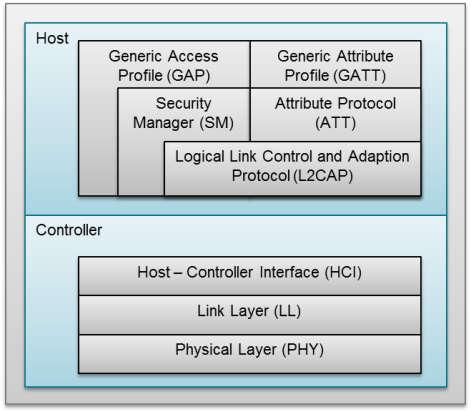
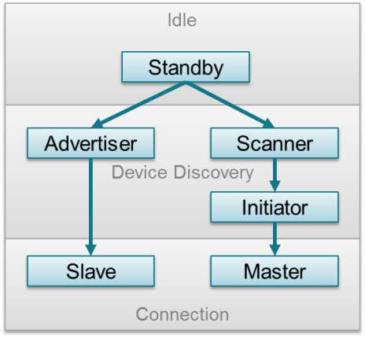
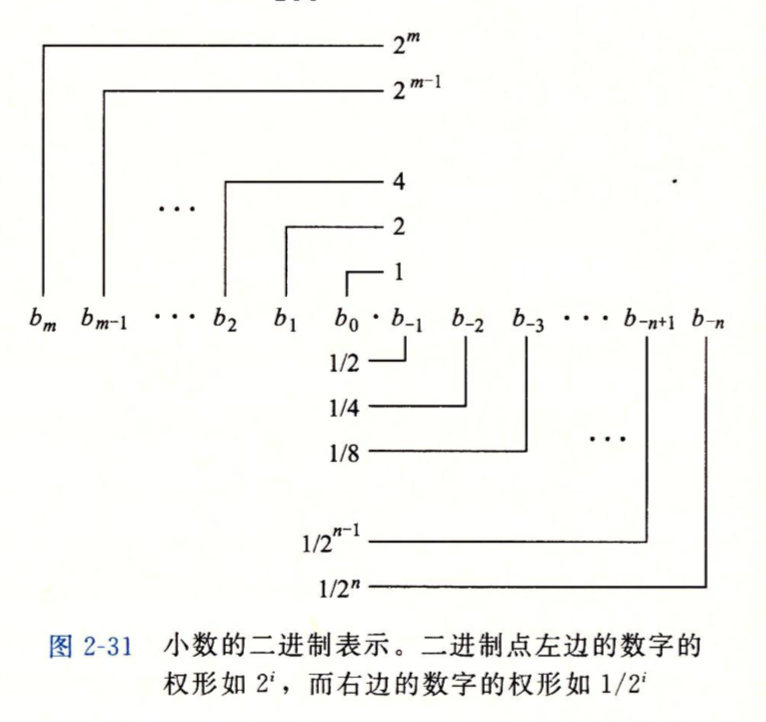
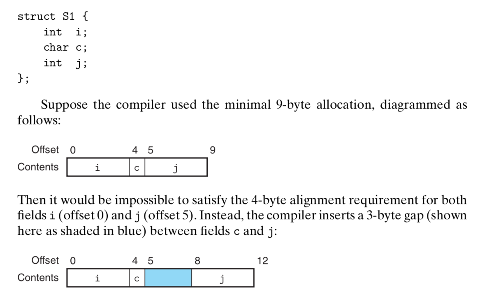
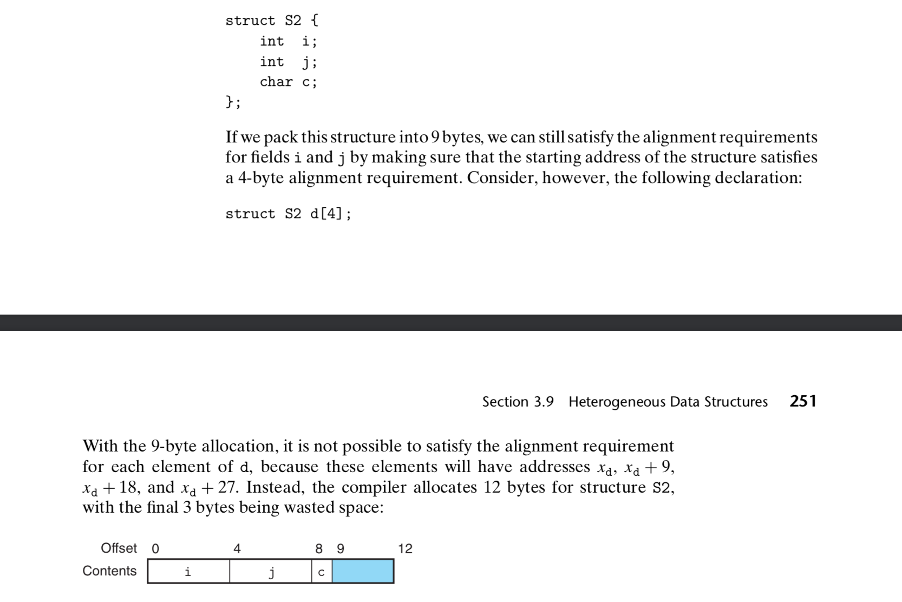

# General Topics

## Bluetooth Low Energy

### Overview

Bluetooth 4.2 allows two systems of wireless technology, Bluetooth Basic Rate (BR: BR/EDR for Basic Rate/Enhanced Data Rate) and Bluetooth Low Energy.

The base rate was usually applied in applications like wirelss headphones. The low engery system was created to trasmit small package of data.


The Bluetooth Low Energy protocol stack consists of host and controller.
- the controller, it consists of three parts: Host-cotroller interfaces, Link layer, and Physical layer.
- the Host, it consists fo GAP, GATT, SM, ATT, L2CAP.
- Any application or profile always sit on hte GAP and GATT layer. Usuallly we only need to take care of GAT and GATT layer.

The GAP layer control the RF state of the device, there are five RF states for a device:
- Standby
- Advertising: advertiser transmited data without connecting
- Scanning: scanner scan for the advertiser
- Initiating: innitiator is a device which respond to a advertiser 
- Connected: when connected, the device become either a master for slave. the connection initialtor is the master, the one accept the request is the slave.

The Logical Link Control and Adaptation Layer Protocol (L2CAP) layer provides data encapsulation services to the upper layers, allowing for logical end-to-end communication of data.


### GAT


#### State diagram of a device


- Standby: The device is in the initial idle state upon reset.
- Advertiser: The device is advertising with specific data letting any initiating devices know that it is a connectible device (this advertisement contains the device address and can contain some additional data such as the device name).
- Scanner: When receiving the advertisement, the scanning device sends a scan request to the advertiser. The advertiser responds with a scan response. This process is called device discovery. The scanning device is aware of the advertising device and can initiate a connection with it.
- Initiator: When initiating, the initiator must specify a peer device address to which to connect. If an advertisement is received matching that address of the peer device, the initiating device then sends out a request to establish a connection (link) with the advertising device with the connection parameters described in Connection Parameters.

#### Connection Parameter


- Connection interval is the amount of time between two connection events
-  If there is no application data to be sent or received, the two devices exchange link layer data to maintain the connection
- Slave Latency - This parameter gives the slave (peripheral) device the option of skipping a number of connection events. 
- Effective connection intervals is the interval between two successful connection event when the slave latency is specified.

### GATT

the GATT layer of the Bluetooth low energy protocol stack is used by the application for data communication between two connected devices

- The GATT server: the device containing the characteristic database that is being read or written by a GATT client.
- The GATT client: the device that is reading or writing data from or to the GATT server.

#### GATT Characteristics and Attributes

- Characteristics as groups of information called attributes
- Attributes are the information actually transferred between devices
- 
#### GATT Security


## Bluetooth Mesh


## Embedded C

### Unsigned vs Signed

Convert the unsigned int to signed int, minus 2^32 if the unsigned int greater than 2^31;
Covert the signed int to unsigned int, plus 2^32 if the signed int less than 0;

```c++
// Function to determine overflow for add two unsigned number
bool uadd_ok(uint32_t x, uint32_t y){
    if(x + y < x)
        // here means overflow
        return false;
    return true;
}

// Functoin to determin overflow for add two signed number
bool sadd_ok(int x, int y){
    if(x > 0 && y > 0){
        if(x + y  <=0)
        // overflow when add two positive integer
            return true;
    }
    if(x < 0 && y< 0){
        if(x + y >=0)
        // overflow when add two negative integer
            return true;
    }
    return false;
}

```
### Floating
The representation of floating point in register are shown above.




### Struct

#### Data alignment

Many computer system has restrictions on data alignment, they only allow the program to access address which is multiple of some value K (typically 2, 4, or 8), and this restriction is called memory alignment.



### Function pointer


```c++
int (*fp) (int); // here remember to define (*fp), otherwise, it means that the function with pointer return type
```

### Dynamic allocate memory
```c++
ptr = (int*) malloc(100 * sizeof(int));	//allocates the specified number of bytes

ptr = realloc(ptr, new_size);	//increases or decreases the size of the specified block of memory, moving it if necessary

ptr = (float*) calloc(25, sizeof(float));	//allocates the specified number of bytes and initializes them to zero
free(*ptr)	//releases the specified block of memory back to the system
```
### Static qulifier
- Static for global variable: access it limited in this file
- Static function: limited acces in file
- Static local variable in function: the value will be maintained between function calls
- 

### Diference between Macro and Inline

## Micro-controller

### GPIO

#### External Pull-up and Pull-down
To ensure a logic level at a pin, avoiding it floating in the air. When a pin is not pulled to a low or high logic level, then the high impedance state occurs.


#### GPIO input mode
High-impedance (default - floats if not driven) 
Pull-up (internal resistor connected to VCC) 
Pull-down (internal resistor connected to Ground)  

### Memory Mapped IO
Memory-mapped I/O uses the same **address space** to address both memory and I/O devices. The memory and registers of the I/O devices are mapped to (associated with) address values. *So when an address is accessed by the CPU, it may refer to a portion of physical RAM, or it can instead refer to memory of the I/O device*. Thus, the CPU instructions used to access the memory can also be used for accessing devices. 
Linux -> ioremap() 

Port-mapped I/O :I/O devices have a separate address space from general memory, either accomplished by an extra "I/O" pin on the CPU's physical interface, or an entire bus dedicated to I/O.  Uses a special class of CPU instructions to access I/O devices 


### ARM ISA
- General purpose register R0 - R12 
- Special purpose: 
  - Stack pointer: points to the top of the stack 
  - Link register: store the return addr when a subroutine call is made 
  - Program counter: incremented by the size of the instruction executed (which is always four bytes in ARM state). Branch instructions load the destination address into PC. During execution, PC stores the address of the current instruction plus 8 (two ARM instructions) in ARM state, and the current instruction plus 4 (two Thumb instructions) in Thumb(v1) state. 
  - Application program status register: holds the program status flags that are accessible in any processor mode.  

### DMA (Direct Memory Access)
Direct memory access (DMA) is an interfacing technique that allows data to transfer directly from I/O device to memory, or from memory to the I/O device without going through the processor. Embedded system designers will need to use DMA when interfacing high speed devices.

### Peripheral Communication

#### SPI

You might be thinking to yourself, self, that sounds great for one-way communications, but how do you send data back in the opposite direction? Here's where things get slightly more complicated.

In SPI, only one side generates the clock signal (usually called CLK or SCK for Serial ClocK). The side that generates the clock is called the "master", and the other side is called the "slave". There is always only one master (which is almost always your microcontroller), but there can be multiple slaves (more on this in a bit).

When data is sent from the master to a slave, it's sent on a data line called MOSI, for "Master Out / Slave In". If the slave needs to send a response back to the master, the master will continue to generate a prearranged number of clock cycles, and the slave will put the data onto a third data line called MISO, for "Master In / Slave Out".


Notice we said "prearranged" in the above description. Because the master always generates the clock signal, it must know in advance when a slave needs to return data and how much data will be returned. This is very different than asynchronous serial, where random amounts of data can be sent in either direction at any time. In practice this isn't a problem, as SPI is generally used to talk to sensors that have a very specific command structure. For example, if you send the command for "read data" to a device, you know that the device will always send you, for example, two bytes in return. (In cases where you might want to return a variable amount of data, you could always return one or two bytes specifying the length of the data and then have the master retrieve the full amount.)

Note that SPI is "full duplex" (has separate send and receive lines), and, thus, in certain situations, you can transmit and receive data at the same time (for example, requesting a new sensor reading while retrieving the data from the previous one). Your device's datasheet will tell you if this is possible.

#### I2C


#### UART


## Linux


### Booting


### Kernel


## Computer Architecture


### 


## Operating System

### Deadlock
- Mutual Exclusion: One or more than one resource are non-sharable (Only one process can use at a time)
- Hold and Wait: A process is holding at least one resource and waiting for resources.
- No Preemption: A resource cannot be taken from a process unless the process releases the resource.
- Circular Wait: A set of processes are waiting for each other in circular form.

### Thread Control Block
- Thread Identifier: Unique id (tid) is assigned to every new thread
- Stack pointer: Points to thread's stack in the process
- Program counter: Points to the current program instruction of the thread
- State of the thread (running, ready, waiting, start, done)
- Thread's register values
- Pointer to the Process control block (PCB) of the process that the thread lives on

The blow shoe the different states of thread

### Process vs Thread
- Threads are not independent of one other like processes as a result threads shares with other threads their code section, data section and OS resources like open files and signals. But, like process, a thread has its own program counter (PC), a register set, and a stack space.
- Processes start out with a single main thread. The main thread can create new threads using a thread fork system call. The new threads can also use this system call to create more threads. Consequently, a thread not only belongs to a process; it also has a parent thread - the thread that created it.

### Thread Synchronization
Locks:
- spin lock
  - With a spinlock, the thread simply waits ("spins") until the lock becomes available. This is efficient if threads are blocked for a short time, because it avoids the overhead of operating system process re-scheduling. 
  - It is inefficient if the lock is held for a long time, or if the progress of the thread that is holding the lock depends on preemption of the locked thread.
- mutex
  - provide mutual exclusion for the resources, and it will block the thread if the resrouce is no availble. CPU would reschedule the thread when the lock is available.

Semaphores:
- counting semaphore
  - Every time you wait on a semaphore, you decrease the current count. 
  - If the count was greater than zero then the decrement just happens, and the wait call returns. 
  - If the count was already zero then it cannot be decremented, so the wait call will block until another thread increases the count by signalling the semaphore.
  - Every time you release a semaphore, you increase the current count.
  - If the count was zero before you called signal, and there was a thread blocked in wait then that thread will be woken. If multiple threads were waiting, only one will be woken
  - If the count was already at its maximum value then the signal is typically ignored, although some semaphores may report an error.


- binary semaphore
  - it is pretty much similar to the mutex

### Producer and Consumer
This is the template for the producer and consumer models in Operating System, it uses the semaphore and mutext to protect resources like ring buffer


### Paging 
Paging is a memory management scheme that eliminates the need for contiguous allocation of physical memory. This scheme permits the physical address space of a process to be non – contiguous.

Pages has two states: **valid** and **resident**.

**Valid** means the page are allocated to the program, and it is legal for the process to access.

**Redident** means the page are already in the physical memory.

Page size usually 4KB or 8KB


#### Virtual Memory


### Inter Process Communication
Inter process communication (IPC) is a mechanism which allows processes to communicate each other and synchronize their actions. 
The communication between these processes can be seen as a method of co-operation between them. Processes can communicate with each other using these two ways:
1. Shared Memory
2. Message passing


## Computer Networks


## Compiler Construction

### Lexical Analysis
It turns a stream of characters into a stream of tokends. Tokens is to define a class of word. Like in engish, we have noun, objective, verb. For programming language we have integer, string, variable and so on.

Typical, in this step, we use regular expression to match these tokens.

### Parsing
Parsing will generate the abstract syntax tree fron the tokens. Parsing using the context free language to describe the grammer.

You can think about the if expression, the root of the syntrax tree will be if_exp, the child will be the condition, codes in the if statement. else 


### Type checking
When we got the syntax tree, then we do type checking of the code. The inference rule will define the type of different expressions. Like for the if statement, the type of its conndition must be bool. For the function call the type checker will check if the type of paramter and the arguments of that function call meet the definition.

### THe last step: code generation


### Program organization

When the program is invoked, the operating system will allocate spaces for this program. The machien code will be loded into the space.

### Optmization
In order to do optimization, we need convert the code into a intermediate representation which is convenient for us to analysis the patterns in the code.
For the dead code elimination, we only do it for assignment instruction. Through the liveness analysis, where the dead code is, and remove it from my syntax tree.


## Advanced Embedded System

### Building Interfaces
Hardware interfaces allow the programmer to not worry about how exactly the hardware works. It creats a level of abstraction. It allows the application to be written independent of platform or target. 

A good hardware interface has three key features:
- easy to use
- efficent 
- portable to other hardware platform

Three competing requirements (triangle):
- usability
- efficiency
- portability

Software or Hardware first?
In terms of interface design, we can start the software design firstly. Give the pre-designed API about how the interface will look like.

### Real-time system
The official definition of a real-time operating system is that: the correctness of system not only rely on the result but also the time of the result was produced.

Why RT system is Hard
- people want a cheap processor as possible
- there are non-cpu resources to worry about
- Validation is hard: it is a simple question of how do people know the system miss the deadline

Validation is catually the process to prove that your solution meet the constriants.

Property of scheduling task:
- Fix/dynamic priority: the prioriity of tasks can be assigned dynamicly or staicly. D: EDF, S: RM
- Preemptive/Non-preemptive tasks: non-preemptive tasks it task that can not be interuptre once it start

Critical instant analysis:
- The worst case for RMS is that all tasks happen to start at the exact same time.


### Kernel

Kernel is a core part of operating system for managing system resources. It more like a bridge between appliation and hardware.
Kernel process and user process has different adress spaces.


### Power Integration


# Resume Details


## CC2640 Bluetoot SoC


## TI-RTOS

The TI-RTOS is a RTOS kernel, specially designed for TI's Bluetooth SoC, like CC2640. It is a real-time, pre-emptive, and multi-threaded operating system.

### Threading module
It has four thread modules. Hardware interrupts, software interrupts, task and idle task.
The TI RTOS manages four distince context levels of thread execution


#### HWI
- threads are threads with highest priority in TI-RTOS
- used to perform the time critical task which are subject to the hard deadline.
- no blocking API may be called HW ISR


#### SWI
- provide addtional level of priority between HWI and normal tasks. 
- SWI is triggered programmatically by calling certain SWI modules API
- Swi allows the HWI to defer the less time critical and more time consuming works to a lower-priority task
- Swi require only enough space to store the context of each Swi priority level, while task actually use a sperate stack for each thread


#### Task
- task thread has lower priority than the SWI, and higher priotiryt than the IDLE task
- TI-RTOIS actually provided many mechanisim for thread synchronization like Semaphores, Event, Message queues


#### Idel Task


### Thread Synchronization Model

#### Semaphores

- Semaphores can be counting semaphores or binary semaphores
- Counting semaphore will track the number of times the semaphore was post. When one task want to grad the semaphore it will see it the count is greater than 0, then decrement the count
- Binary semaphore can be regraded as mutex

#### Event
- It was implemented through the semaphore
- The task can be pending on several event happen.
- Event can be posted by calling the Event API in TI-RTOS


#### Message Queue

- Message queue provides thead-safe unidirectional message passing module, like a FIFO. 
- It was commonly used to pass messages from high priority task to low priority task.
- For the key pad, once it was pressed, it will triger the HWI to pass the message to the user application task, it will read the key value from the Key Pad scanning IC. The work associated to the inerrupt can defered to tasks for processing.
- The queue is also used to process the message sent from the Blueooth Protocol Stack. 


#### Tasks 
  

Different states of tasks:

- Running: task is currently running
- Ready: task is scheduled for execution
- Blocked: task is suspended from execution
- Terminated: task is terminated from execution
- Inactive: task is on inactive list

## AliOS-Things
